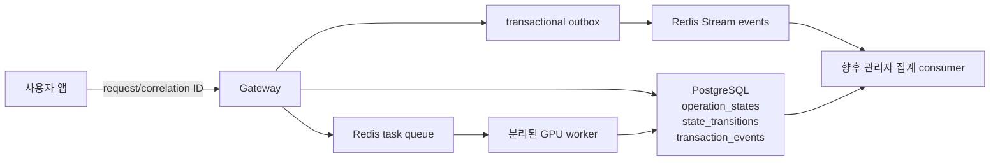

# MemoryPal 상태관리 기준

중·대형 전환에서 상태의 최종 기준은 PostgreSQL이고, Redis는 빠른 작업 전달과
실시간 이벤트 전파를 담당한다. Redis 값만으로 사용자 작업의 최종 성공 여부를
판단하지 않는다.



## 상태의 역할

- `operation_states`: 작업마다 현재 상태, 진행률, 낙관적 잠금 `version`, 오류 코드,
  요청·상관관계 ID를 보관하는 현재 스냅샷이다.
- `operation_state_transitions`: 상태가 바뀐 모든 시점을 append-only로 기록한다.
  장애 전후의 실제 순서를 재구성할 때 사용한다.
- `user_transaction_events`: HTTP 거래 결과와 지연시간을 metadata-only 이벤트로
  보관한다. 인증 완료 후 확인된 사용자 ID가 연결된다.
- `event_outbox`: 거래 이벤트와 같은 DB 트랜잭션에서 생성된다. Redis 발행이
  실패해도 유실하지 않고 재전송하며, `event_id`를 멱등 키로 사용한다.
- Redis 작업 큐: 자화상처럼 오래 걸리는 GPU 작업을 Gateway 프로세스에서 떼어낸다.
  dedupe key, receipt, lease, heartbeat, retry 횟수, 진행률을 관리한다.
- Redis Streams: 관리자 실시간 화면이나 분석 consumer가 consumer group으로 읽을
  수 있는 운영 이벤트다. PostgreSQL의 이력이 최종 복구 기준이다.

## 허용 상태 전이

```text
queued  -> running | failed | cancelled
running -> retrying | succeeded | failed | cancelled
retrying -> queued | running | failed | cancelled
succeeded / failed / cancelled -> terminal (변경 불가)
```

진행률은 감소하지 않고, 모든 갱신은 `version` 비교 후 적용한다. 작업 ID와 dedupe
키는 사용자 입력문을 그대로 쓰지 않고 불투명한 UUID 또는 내부 식별자로 만든다.
GPU 자화상 worker는 Redis lease와 PostgreSQL lease를 함께 갱신하며, DB의 동일
`generation_id`가 `complete`인 것을 확인한 뒤에만 큐를 ACK한다.

## 향후 관리자 페이지 read contract

관리자 API는 별도 관리자 인증·권한을 추가한 뒤 아래 읽기 모델만 노출한다.

- 실시간 작업: `operation_type`, `status`, `progress_percent`, `updated_at`, 오류 코드
- 사용자별 거래 흐름: `user_id`, `correlation_id`, 정규화된 API 경로, 결과, 지연시간
- 집계: 시간대/경로별 거래 수, 활성 사용자 수, 성공률, 평균·최대 지연시간
- 장애 추적: 실패 상태에서 같은 `correlation_id`의 transition과 outbox 재시도 연결

PostgreSQL의 `admin_transaction_hourly_metrics`와
`admin_operation_status_metrics` view가 초기 read model이다. 애플리케이션
repository의 `list_operations`, `list_transaction_events`,
`summarize_transaction_events`는 관리자 API 구현 시 사용할 필터 계약이다.

## 개인정보·보안 경계

운영 이벤트와 Redis Stream에는 다음 값을 넣지 않는다.

- 사용자/AI 대화문, 프롬프트, 추론 내용
- 첨부 문서 본문, 음성 파일·전사문, 자화상 요약문
- 비밀번호, JWT, Authorization/Cookie 헤더, 전체 이메일
- 외부 서비스 응답 본문

허용 값은 불투명 ID, 작업/이벤트 종류, 상태, 정규화된 route template, HTTP 상태,
오류 코드, 지연시간, 비민감 카운터와 모델 버전뿐이다. 관리자 개인 조회는 감사
로그와 최소권한 역할을 추가한 뒤 활성화한다.

## 확장 순서

1. 현재 단계: PostgreSQL pool, operation state machine, metadata event, outbox,
   Redis queue/Stream, 별도 worker.
2. 관리자 페이지 도입: 관리자 RBAC/MFA, read-only API, 감사 로그, 집계 consumer.
3. 이벤트가 수백만 행 이상 지속될 때: 월 단위 `occurred_at` 파티션과 보존 정책.
4. consumer 증가 시: consumer group별 lag/PEL, stale message reclaim, DLQ 알림.
5. 트래픽 증가 시: API 수평 확장, PgBouncer, worker 종류별 queue와 GPU lock 분리.

운영 지표의 `정확도`와 사용자 콘텐츠 분석 결과는 분리한다. 전자는 거래 성공률과
지연시간 같은 시스템 지표이고, 후자는 권한이 있는 원본 도메인 테이블에서만 읽는다.
